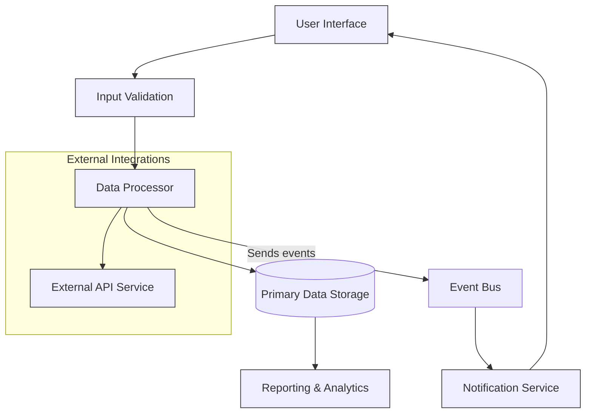

## Visualizing System Architecture: Understanding Components and Data Flow

A clear understanding of how a system’s components interact and how data travels through its architecture is essential for both strategic decision-making and effective development. This page serves as a comprehensive visual guide that illustrates the main modules of the system, their relationships, and the flow of information connecting them. By engaging with this high-level diagram, users can quickly grasp integration points, dependencies, and the overall design intent that supports the product’s functionality.

### Defining System Architecture for Stakeholders and Developers

System Architecture represents the blueprint of the product at a component level, detailing individual modules and how they interconnect to fulfill user needs. It provides a shared language to bridge the gap between technical teams and business stakeholders, allowing everyone to see how pieces work together toward common goals. This overview is designed for architects, developers, team leads, and technical decision-makers seeking to understand both the ‘what’ and the ‘why’ behind the system’s structure.

### Core Model of Interaction and Data Movement

At its core, the architecture follows a modular approach, with distinct services or components collaborating to process input data and generate outcomes. Each module has a specific responsibility and communicates through well-defined interfaces, enabling extensibility and maintainability. The data flow lines demonstrate how information cascades from input sources through validation, processing, and storage, ultimately reaching output or user-facing endpoints.

This diagram captures the fundamental flow from user actions, input verification, data processing, and then onward to storage and analytics—while also highlighting asynchronous event handling and external API calls.

### Architecture in Action: Real-World Impact

Imagine a user submitting a file for processing within the system. Their input first passes through the validation stage to ensure compliance with format and content rules. Once validated, the data processor applies core algorithms to analyze or transform the file. The results are stored securely in the primary database, making them accessible for detailed reporting and insights.

Meanwhile, the system triggers event notifications to alert other components or the user interface about processing status or errors. Integration with external APIs enables additional data enrichment or verification without disrupting the core flow. This decoupled, event-driven design supports scalability and enables rapid feature enhancements without risking system stability.

For example, a user monitoring dashboard reflects real-time status changes powered through the notification service’s events, ensuring users stay informed without refreshing or manual polling.

### Starting with System Architecture

Exploring this page equips you with the foundational understanding needed before diving into detailed product features or implementation specifics. The architecture visualization will aid your comprehension as you navigate the service’s capabilities and workflows.

To begin, review the [Getting Started](/overview/intro-architecture/product-overview) section for foundational setup and terminology. From there, consider looking at the [Core Concepts & Terminology](/overview/concepts-features/core-concepts) page to expand your understanding of how components translate into user-facing features.

Understanding this systemic layout empowers you to anticipate integration points and troubleshoot more effectively, accelerating your journey to mastery.

<Source url="https://github.com/gabriel-vasile/mimetype" branch="main" paths={[{"path": "docs/architecture.md", "range": "1-45"}]} />